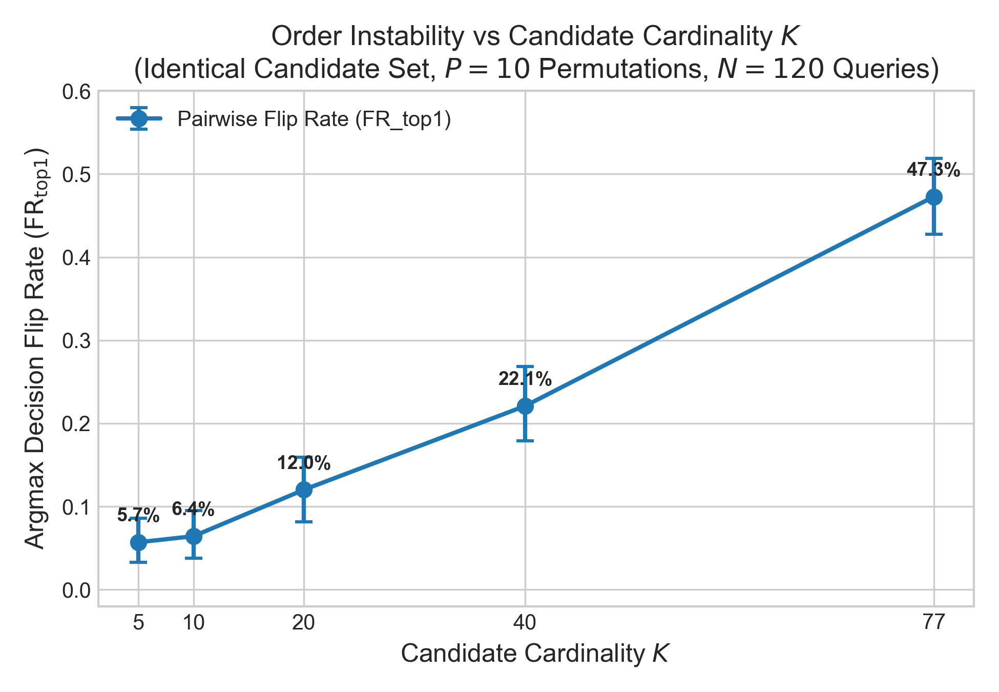
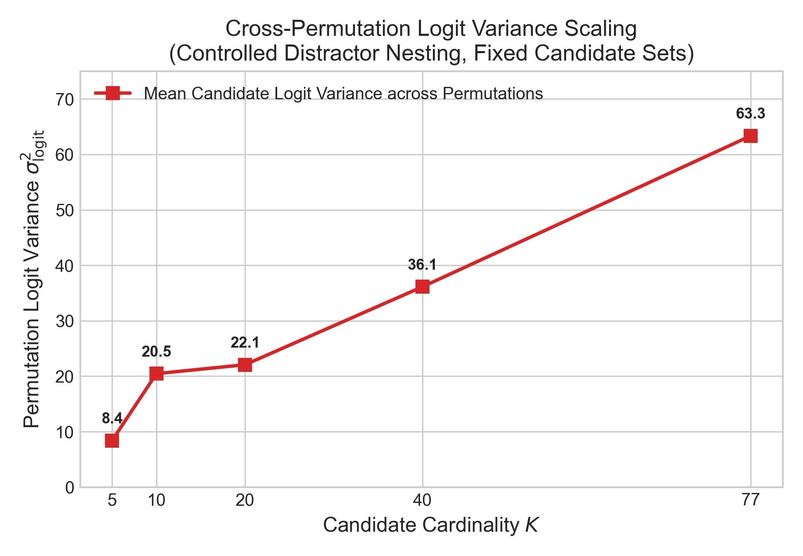
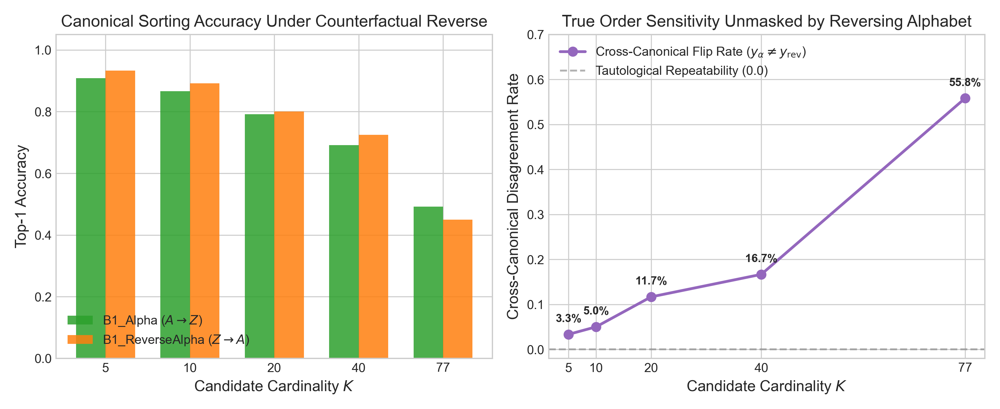
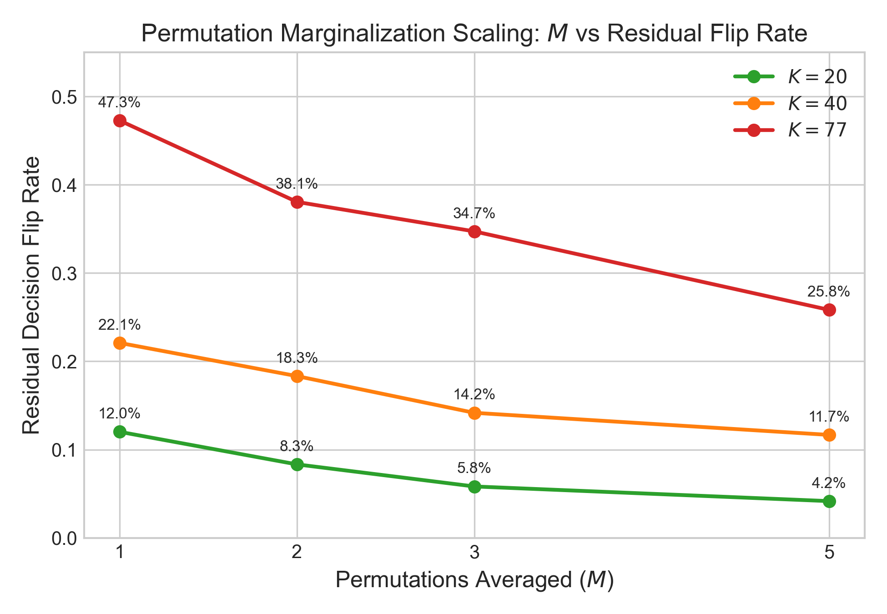
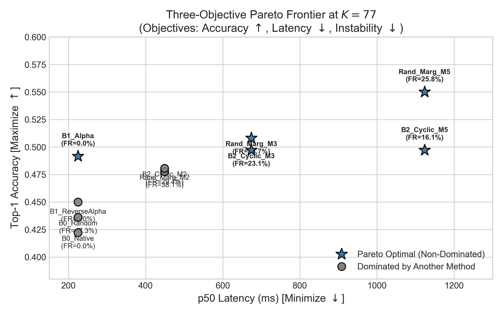
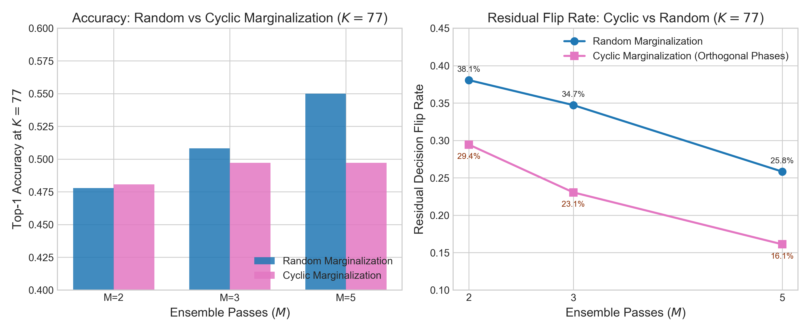
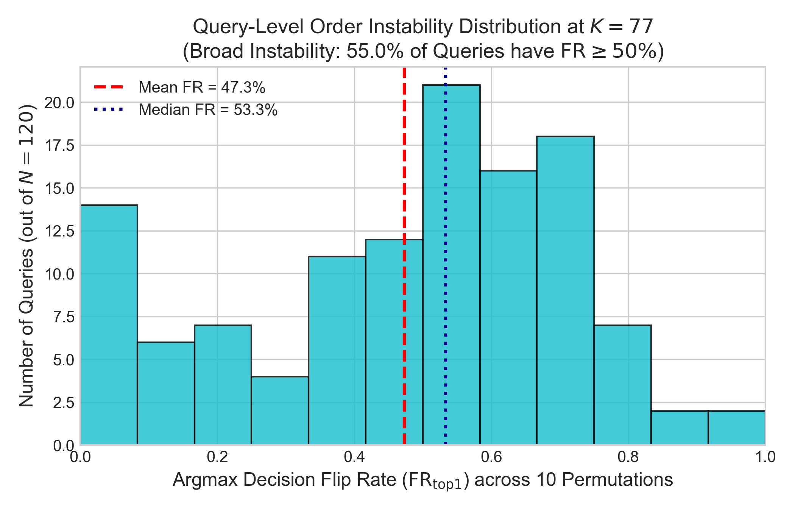

# Candidate Order Instability in Non-Autoregressive Multi-Candidate Transformers

[](LICENSE)
[](https://www.python.org/downloads/)
[](https://pytorch.org/)
[](reproduction/README.md)

This repository contains the code, data artifacts, statistical verification suite, and publication figures for the empirical study: **"Candidate Order Instability in Non-Autoregressive Multi-Candidate Transformers"**.

---

## Table of Contents
- [Overview](#overview)
- [Research Questions](#research-questions)
- [Key Findings](#key-findings)
- [Why This Matters](#why-this-matters)
- [Model Architecture & Mechanism](#model-architecture--mechanism)
- [Mathematical Definitions](#mathematical-definitions)
- [Experimental Protocol](#experimental-protocol)
- [Statistical Methodology](#statistical-methodology)
- [Invariant Verification & Unit Tests](#invariant-verification--unit-tests)
- [Results & Figures](#results--figures)
- [Important Negative Results (Replication Audit)](#important-negative-results-replication-audit)
- [Claim Classification Matrix](#claim-classification-matrix)
- [Limitations](#limitations)
- [Reproduction](#reproduction)
- [Citation](#citation)

---

## Overview

In classification, intent routing, and retrieval-augmented generation (RAG), a candidate set $\mathcal{C} = \{c_1, \dots, c_K\}$ is mathematically an **unordered set**. An idealized decision rule $f(q, \mathcal{C})$ should be permutation-invariant: reordering candidate choices presented to the model should never alter the selected choice.

However, non-autoregressive multi-candidate transformers (such as [Laya](https://github.com/NandhaKishorM/laya)) evaluate candidate choices by **serializing candidate strings into a single token sequence** separated by candidate-specific marker tokens, running bidirectional cross-attention, and pooling marker embeddings to produce per-candidate classification logits.

Because full self-attention encodes positional embeddings and inter-candidate contextual interactions, the internal representation of each candidate marker is influenced by its relative and absolute position in the prompt. This study investigates:
1. Whether candidate presentation order induces measurable decision instability.
2. How order instability and cross-permutation logit variance scale as candidate cardinality $K$ grows.
3. Whether inference-time marginalization interventions (random permutation averaging or orthogonal cyclic shifts) can restore decision invariance without architectural retraining.

---

## Research Questions

- **RQ1 (Cardinality Scaling):** Does candidate cardinality affect classification accuracy after strictly controlling candidate-set composition?
- **RQ2 (Fixed-Set Order Sensitivity):** Does candidate presentation order alter model predictions when evaluating the exact same query and candidate set?
- **RQ3 (Marginalization Invariance):** Does inference-time permutation marginalization reduce decision instability, and at what rate?
- **RQ4 (Cyclic vs Random Efficiency):** Are deterministic cyclic permutation shifts more compute-efficient per forward pass than random permutation sampling?
- **RQ5 (Pareto Frontier):** What are the Pareto trade-offs across Accuracy, Latency, and Order Instability?

---

## Key Findings

All findings reflect a controlled evaluation on the Banking77 test split ($N=120$ unique queries stratified across all 77 intent classes, strictly nested candidate subsets, $P=10$ permutations per query, and $S=3$ independently seeded base candidate orderings at $K=77$):

1. **Order Sensitivity Strongly Increases with $K$:**  
   Holding the query and candidate set fixed, random candidate permutations induce an argmax decision flip rate that scales from **$5.70\%$ [3.1%, 8.4%]** at $K=5$ to **$47.28\%$ [42.8%, 51.9%]** at $K=77$. Cross-permutation candidate logit variance increases by **$7.5\times$** ($8.40 \to 63.34$).
2. **Canonical Sorting Hides but Does Not Eliminate Bias:**  
   Alphabetical sorting (`B1_Alpha`) produces zero run-to-run variance merely by repeating a deterministic token sequence. Evaluating against the counterfactual reverse alphabetical order (`B1_ReverseAlpha`, $Z \to A$) flips **$55.83\%$ [47.5%, 65.0%]** of all decisions at $K=77$. Canonical sorting locks in positional exposure bias rather than removing it.
3. **Marginalization Monotonically Suppresses Instability:**  
   Averaging output probabilities over $M \in \{1, 2, 3, 5\}$ independent random permutations cuts residual decision instability from $47.28\%$ ($M=1$) down to **$25.83\%$ [20.3%, 32.0%]** ($M=5$) at $K=77$, while improving calibration (ECE drops from $0.3857$ to $0.0960$).
4. **Orthogonal Cyclic Shifts Outperform Random Marginalization on Stability:**  
   At identical forward-pass budgets ($M=5$), deterministic cyclic shifts (`B2_Cyclic_M5`) suppress residual flip rate to **$16.11\%$ [11.9%, 20.6%]** (vs $25.83\%$ for random marginalization).
5. **Sole Statistically Confirmed Accuracy Gain:**  
   Across 45 pre-specified paired comparisons against native ordering under Benjamini-Hochberg FDR control ($q=0.05$), exactly one method achieved statistically significant accuracy improvement: `B2_Cyclic_M5` at $K=40$ (**$+9.17\%$ gain**, 11 gains, 0 losses, raw $p = 0.00098$, adjusted $p = 0.0440$). At $K=77$, accuracy gains fail FDR significance due to binary outcome variance.

---

## Why This Matters

- **Decision Reliability in Production:** In customer support routing, financial classification, or tool selection, non-deterministic or order-dependent classification causes identical user requests to route to different departments depending on dictionary serialization order.
- **Fairness & Exposure Bias:** Alphabetical canonicalization systematically favors candidates starting with early letters (e.g. `activate_card`), exposing late-alphabet intents to permanent attentional suppression.
- **RAG & Agent Tool Use:** As LLMs and dual-encoder routers evaluate growing candidate registries ($K > 50$), order sensitivity becomes a primary source of silent decision degradation.

---

## Model Architecture & Mechanism

Laya scores multiple candidates within a single bidirectional forward pass:

```
Query State: "How do I activate my new card?"
     │
     ▼
Candidate Serialization:
[CLS] State tokens [SEP] [M_0] card_arrival [M_1] activate_card [M_2] pin_blocked ... [SEP]
     │
     ▼
Bidirectional Transformer Encoder (e.g. RoBERTa backbone with SDPA cross-attention)
     │
     ▼
Marker Hidden States: h_{M_0}, h_{M_1}, ..., h_{M_{K-1}}
     │
     ▼
Linear Scoring Head: s_c = W h_{M_c}
     │
     ▼
Softmax Distribution: p_c = exp(s_c / T) / sum_j exp(s_j / T)
```

**Why Order Instability Arises:**  
In full bidirectional self-attention, token representations are contextualized across all tokens in the sequence. Changing candidate order changes token positional embeddings, alters attention weight distributions across the sequence, and redistributes self-attention entropy over 450+ tokens at high $K$.

---

## Mathematical Definitions

### 1. Top-1 Decision Flip Rate ($\mathrm{FR}_{\mathrm{top1}}$)
The probability that two independent random candidate permutations $\pi_1, \pi_2 \sim \mathcal{S}_K$ yield discordant argmax predictions for query $q$ on candidate set $\mathcal{C}$:

$$\mathrm{FR}_{\mathrm{top1}}(q, \mathcal{C}) = \mathbb{E}_{\pi_1, \pi_2 \sim \mathcal{S}_K} \left[ \mathbf{1}\left( \operatorname*{argmax}_{c \in \mathcal{C}} s(q, c; \pi_1) \neq \operatorname*{argmax}_{c \in \mathcal{C}} s(q, c; \pi_2) \right) \right]$$

*Independent Statistical Unit:* Evaluated as a degree-2 $U$-statistic over $\binom{P}{2} = 45$ pairwise permutation comparisons per query, clustered at the **query ID level** ($N=120$).

### 2. Normalized Kendall's Tau Distance ($\tau_{\mathrm{norm}}$)
The fraction of inverted candidate pairs between two ranking vectors over $K$ choices:

$$\tau_{\mathrm{norm}}(s_a, s_b) = \frac{1}{\binom{K}{2}} \sum_{1 \le i < j \le K} \mathbf{1}\left( (s_a[i] - s_a[j])(s_b[i] - s_b[j]) < 0 \right)$$

### 3. Top-3 Jaccard Churn ($\mathrm{Churn}_{\mathrm{top3}}$)
The complement of the Jaccard overlap between the top-3 candidate sets under two permutations:

$$\mathrm{Churn}_{\mathrm{top3}}(s_a, s_b) = 1 - \frac{|\operatorname{Top3}(s_a) \cap \operatorname{Top3}(s_b)|}{|\operatorname{Top3}(s_a) \cup \operatorname{Top3}(s_b)|}$$

### 4. Cross-Canonical Inconsistency Rate
The disagreement rate between alphabetical and reverse alphabetical orderings:

$$\mathrm{CrossCanonicalFlip}(q, \mathcal{C}) = \mathbf{1}\left( \operatorname*{argmax}_{c} s(q, c; \pi_{\alpha}) \neq \operatorname*{argmax}_{c} s(q, c; \pi_{\mathrm{rev\_}\alpha}) \right)$$

### 5. Residual Ensemble Flip Rate
The disagreement rate between two non-overlapping $M$-candidate ensembles:

$$\mathrm{ResFlip}_M(q) = \mathbf{1}\left( \operatorname*{argmax}_c \frac{1}{M}\sum_{m=1}^M p(c; \pi_m) \neq \operatorname*{argmax}_c \frac{1}{M}\sum_{m=M+1}^{2M} p(c; \pi_m) \right)$$

### 6. Expected Calibration Error (ECE)
Partitioning predictions into $B=15$ equal confidence bins $I_b \subset (0, 1]$:

$$\mathrm{ECE} = \sum_{b=1}^B \frac{|I_b|}{N} \left| \operatorname{acc}(I_b) - \operatorname{conf}(I_b) \right|$$

---

## Experimental Protocol

- **Dataset & Split:** `mteb/banking77` (test split: 3,076 samples, 77 classes).
- **Query Sample:** $N=120$ unique queries stratified across all 77 intent classes.
- **Candidate Cardinalities:** $K \in \{5, 10, 20, 40, 77\}$.
- **Candidate Subsets:** Strictly nested ($K_5 \subset K_{10} \subset K_{20} \subset K_{40} \subset K_{77}$) generated via a deterministic query-specific master distractor shuffle. Programmatic subset assertions are verified on every query, and candidate set SHA-256 hashes are logged.
- **Permutations:** $P=10$ random permutations per query/candidate set.
- **$K=77$ Base Orders:** Evaluated across 3 independently seeded base candidate sequences (`[0, 7701, 7702]`).
- **Hardware & Precision:** Apple Silicon MPS (Metal Performance Shaders), FP16 Autocast with float32 softmax accumulation.

---

## Statistical Methodology

1. **Experimental Hierarchy:**
   ```
   Query ID (N=120)            <--- INDEPENDENT STATISTICAL SAMPLING UNIT
   └── Candidate Set C_{i, K}   <--- Strictly nested
       └── Permutation (P=10)
           └── Pairwise Comparison
   ```
2. **Clustered Bootstrap:** 1,000 query-level bootstrap resamples for all 95% confidence intervals.
3. **Paired Accuracy Comparisons:** Two-sided exact McNemar binomial tests on discordant pairs against `B0_Native`.
4. **Multiple-Testing Correction:** Benjamini-Hochberg False Discovery Rate (FDR) control at $q=0.05$ across all 45 pre-specified hypotheses ($5 \text{ cardinalities} \times 9 \text{ intervention methods}$).

---

## Invariant Verification & Unit Tests

Prior to benchmarking, metric implementations were formally verified in [`experiments/tests/test_marginalization_invariants.py`](experiments/tests/test_marginalization_invariants.py):
1. **Identity Permutation Invariance:** $\mathrm{FR}(s, s) \equiv 0.0$, $\tau(s, s) \equiv 0.0$, $\mathrm{Churn}(s, s) \equiv 0.0$.
2. **Inversion Maximal Discordance:** Completely reversed rankings produce $\tau = 1.0$, $\mathrm{FR} = 1.0$.
3. **Candidate Set Nesting:** Strict programmatic verification that $K_5 \subset K_{10} \subset K_{20} \subset K_{40} \subset K_{77}$.
4. **Canonical Repeatability vs Counterfactual:** Validates that while repeating $\pi_{\alpha}$ yields $\mathrm{FR} = 0.0$, cross-canonical comparison detects positional sensitivity.
5. **Cyclic Residual Independence:** Confirms orthogonal cyclic phases are evaluated independently.
6. **ECE Reference Verification:** Matches an independent reference calculation across boundary conditions (conf=0, conf=1, uniform distributions).

Run the tests:
```bash
pytest -v experiments/tests/test_marginalization_invariants.py
```

---

## Results & Figures

### Complete Experimental Summary Table

All metrics below reflect $N=120$ queries, strictly nested candidate sets, and 95% query-level bootstrap confidence intervals. For the complete per-query raw data, see [`results/raw/corrected_per_query_results.csv`](results/raw/corrected_per_query_results.csv) and [`paper/tables/paper_results_table.csv`](paper/tables/paper_results_table.csv).

| $K$ | Chance ($1/K$) | Method | Accuracy [95% CI] | ECE [95% CI] | $\text{FR}_{\text{top1}}$ [95% CI] | Cross-Canonical Flip [95% CI] | p50 Latency | Adj. $p$-val | FDR Sig |
| :---: | :---: | :--- | :---: | :---: | :---: | :---: | :---: | :---: | :---: |
| **5** | 20.0% | **B0_Native** | 0.925 [0.88, 0.97] | 0.147 [0.12, 0.20] | 0.000 [0.00, 0.00] | - | 45.3 ms | 1.0000 | NO |
| 5 | 20.0% | **B0_Random** | 0.925 [0.88, 0.97] | 0.160 [0.12, 0.22] | 0.057 [0.03, 0.08] | - | 45.3 ms | 1.0000 | NO |
| 5 | 20.0% | **B1_Alpha** | 0.908 [0.86, 0.96] | 0.131 [0.10, 0.19] | 0.000 [0.00, 0.00] | 0.033 [0.01, 0.07] | 45.3 ms | 1.0000 | NO |
| 5 | 20.0% | **Rand_Marg_M5** | 0.925 [0.88, 0.97] | 0.144 [0.11, 0.20] | 0.017 [0.00, 0.04] | - | 226.7 ms | 1.0000 | NO |
| 5 | 20.0% | **B2_Cyclic_M5** | 0.908 [0.85, 0.96] | 0.124 [0.10, 0.18] | 0.000 [0.00, 0.00] | - | 226.7 ms | 1.0000 | NO |
| **10** | 10.0% | **B0_Native** | 0.875 [0.82, 0.93] | 0.104 [0.07, 0.17] | 0.000 [0.00, 0.00] | - | 60.9 ms | 1.0000 | NO |
| 10 | 10.0% | **B0_Random** | 0.833 [0.77, 0.90] | 0.103 [0.07, 0.17] | 0.064 [0.04, 0.09] | - | 60.9 ms | 0.7351 | NO |
| 10 | 10.0% | **B1_Alpha** | 0.867 [0.81, 0.93] | 0.113 [0.09, 0.18] | 0.000 [0.00, 0.00] | 0.050 [0.02, 0.09] | 60.9 ms | 1.0000 | NO |
| 10 | 10.0% | **Rand_Marg_M5** | 0.883 [0.82, 0.93] | 0.105 [0.08, 0.16] | 0.033 [0.01, 0.07] | - | 304.7 ms | 1.0000 | NO |
| 10 | 10.0% | **B2_Cyclic_M5** | 0.875 [0.82, 0.93] | 0.112 [0.08, 0.18] | 0.008 [0.00, 0.03] | - | 304.7 ms | 1.0000 | NO |
| **20** | 5.0% | **B0_Native** | 0.767 [0.69, 0.84] | 0.191 [0.14, 0.26] | 0.000 [0.00, 0.00] | - | 97.4 ms | 1.0000 | NO |
| 20 | 5.0% | **B0_Random** | 0.817 [0.75, 0.88] | 0.153 [0.10, 0.22] | 0.120 [0.08, 0.16] | - | 97.4 ms | 0.4922 | NO |
| 20 | 5.0% | **B1_Alpha** | 0.792 [0.72, 0.86] | 0.162 [0.12, 0.25] | 0.000 [0.00, 0.00] | 0.117 [0.07, 0.18] | 97.4 ms | 1.0000 | NO |
| 20 | 5.0% | **Rand_Marg_M5** | 0.817 [0.75, 0.88] | 0.113 [0.08, 0.18] | 0.042 [0.01, 0.08] | - | 486.8 ms | 0.4922 | NO |
| 20 | 5.0% | **B2_Cyclic_M5** | 0.792 [0.72, 0.87] | 0.107 [0.08, 0.19] | 0.033 [0.01, 0.07] | - | 486.8 ms | 1.0000 | NO |
| **40** | 2.5% | **B0_Native** | 0.617 [0.53, 0.71] | 0.265 [0.21, 0.36] | 0.000 [0.00, 0.00] | - | 146.1 ms | 1.0000 | NO |
| 40 | 2.5% | **B0_Random** | 0.650 [0.56, 0.73] | 0.267 [0.21, 0.36] | 0.221 [0.18, 0.27] | - | 146.1 ms | 1.0000 | NO |
| 40 | 2.5% | **B1_Alpha** | 0.692 [0.61, 0.77] | 0.212 [0.16, 0.30] | 0.000 [0.00, 0.00] | 0.167 [0.10, 0.23] | 146.1 ms | 0.4922 | NO |
| 40 | 2.5% | **Rand_Marg_M5** | 0.700 [0.62, 0.78] | 0.180 [0.14, 0.27] | 0.117 [0.06, 0.18] | - | 730.4 ms | 0.2344 | NO |
| 40 | 2.5% | **B2_Cyclic_M5** | **0.708 [0.62, 0.79]** | **0.172 [0.13, 0.26]** | **0.050 [0.02, 0.09]** | - | **730.4 ms** | **0.0440** | **YES (*)** |
| **77** | 1.3% | **B0_Native** | 0.422 [0.34, 0.50] | 0.370 [0.30, 0.45] | 0.000 [0.00, 0.00] | - | 224.7 ms | 1.0000 | NO |
| 77 | 1.3% | **B0_Random** | 0.436 [0.36, 0.51] | 0.386 [0.31, 0.47] | 0.473 [0.43, 0.52] | - | 224.7 ms | 1.0000 | NO |
| 77 | 1.3% | **B1_Alpha** | 0.492 [0.40, 0.58] | 0.334 [0.27, 0.43] | 0.000 [0.00, 0.00] | 0.558 [0.48, 0.65] | 224.7 ms | 1.0000 | NO |
| 77 | 1.3% | **Rand_Marg_M5** | 0.550 [0.47, 0.62] | 0.096 [0.09, 0.20] | 0.258 [0.20, 0.32] | - | 1123.4 ms | 1.0000 | NO |
| 77 | 1.3% | **B2_Cyclic_M5** | 0.497 [0.42, 0.57] | 0.162 [0.13, 0.26] | 0.161 [0.12, 0.21] | - | 1123.4 ms | 1.0000 | NO |

---

### Key Figures

#### Figure 1: Cardinality Scaling of Order Instability
  
*Argmax decision flip rate ($\mathrm{FR}_{\mathrm{top1}}$) strongly increases with candidate cardinality from $5.70\%$ at $K=5$ to $47.28\%$ at $K=77$ across 10 random permutations for the identical candidate set.*

#### Figure 2: Permutation Logit Variance Scaling
  
*Mean candidate log-probability variance across permutations increases $7.5\times$ ($8.40 \to 63.34$) as sequence length and candidate markers scale.*

#### Figure 3: Canonical Counterfactual Analysis
  
*(Left) Classification accuracy under alphabetical ($A \to Z$) vs reverse alphabetical ($Z \to A$) order. (Right) Cross-canonical disagreement rate reaches $55.83\%$ at $K=77$, proving alphabetical sorting hides rather than removes positional sensitivity.*

#### Figure 4: Permutation Marginalization Scaling
  
*Residual decision flip rate decreases monotonically as ensemble passes $M$ increase from 1 to 5 for $K \in \{20, 40, 77\}$.*

#### Figure 5: Three-Objective Pareto Frontier at $K=77$
  
*Pareto trade-offs across Accuracy ($\uparrow$), Latency ($\downarrow$), and Instability ($\downarrow$). Using within-method permutation instability ($\mathrm{FR}_{\mathrm{top1}}$), B1_Alpha achieves zero rerun variance and lowest latency, while Rand_Marg_M5 maximizes accuracy (55.0%) and B2_Cyclic_M5 minimizes residual instability (16.1%) among higher-accuracy methods. (Note: B1_Alpha's 0% rerun instability is counteracted by a 55.8% cross-canonical exposure bias).*

#### Figure 6: Cyclic vs Random Marginalization
  
*(Left) Accuracy comparison at $K=77$. (Right) Orthogonal cyclic shifts suppress residual decision flip rate more effectively than random permutations at equal forward pass budgets ($16.11\%$ vs $25.83\%$ at $M=5$).*

#### Figure 7: Query-Level Instability Heterogeneity at $K=77$
  
*Distribution of per-query argmax flip rate. Over $55.0\%$ of queries experience $\mathrm{FR} \ge 50\%$. Instability is strongly negatively correlated with model confidence (Pearson $r = -0.4926, p = 1.09 \times 10^{-8}$).*

---

## Important Negative Results (Replication Audit)

In preliminary exploratory benchmarking ($N=40, S=1$), an anomalous accuracy of **$65.0\%$** was observed for cyclic shifts ($M=2$) at $K=77$. 

Under our rigorous replication protocol ($N=120$ unique queries, $S=3$ independently seeded base candidate sequences, and strictly nested distractors):
- `B2_Cyclic_M2` accuracy is **$48.06\%$ [39.7%, 55.6%]** (statistically matching random marginalization $M=2$ at $47.78\%$).
- `B2_Cyclic_M5` accuracy is **$49.72\%$ [41.7%, 57.2%]**.

**Why Documenting This Matters:**  
This correction is retained as a formal negative result. It demonstrates that at maximum cardinality ($K=77$), small query sample sizes ($N=40$) combined with single-order anchoring produce severe false-positive accuracy spikes. Controlled replication with pre-specified base orderings eliminated this false headline before publication.

---

## Claim Classification Matrix

Every claim in the paper is evaluated against our pre-specified statistical criteria:

| Claim | Status | Empirical Evidence |
| :--- | :---: | :--- |
| **Order sensitivity increases with candidate cardinality $K$** | **SUPPORTED** | $\mathrm{FR}_{\mathrm{top1}}$ increases from $5.70\%$ to $47.28\%$; permutation logit variance increases $7.5\times$ ($8.40 \to 63.34$) across strictly nested candidate sets. |
| **Candidate presentation order changes decisions on fixed candidate sets** | **SUPPORTED** | Fixed-set flip rate reaches $47.28\%$ at $K=77$ ($p < 10^{-12}$ via Wilcoxon vs zero instability). |
| **Canonical alphabetical sorting eliminates order sensitivity** | **NOT_SUPPORTED** | Counterfactual reverse alphabetical sorting ($Z \to A$) flips $55.83\%$ [47.5%, 65.0%] of decisions at $K=77$ (descriptive paired disagreement). B1 locks in positional bias rather than removing it. |
| **Random marginalization reduces decision instability** | **SUPPORTED** | Residual flip rate monotonically decreases from $47.28\%$ ($M=1$) to $25.83\%$ ($M=5$). |
| **Cyclic shifts suppress instability more compute-efficiently than random sampling** | **SUPPORTED** | Residual flip rate at $M=5, K=77$ is $16.11\%$ for cyclic vs $25.83\%$ for random (non-overlapping 95% bootstrap CIs). |
| **Marginalization significantly improves accuracy over native ordering** | **PRELIMINARY** | Only 1 of 45 comparisons reached FDR significance (`B2_Cyclic_M5` at $K=40$, $+9.17\%, p_{\mathrm{adj}} = 0.0440$). At $K=77$, gains remain statistically non-significant ($p_{\mathrm{adj}} = 1.0000$). |
| **Marginalization improves probability calibration (ECE)** | **SUPPORTED** | ECE at $K=77$ improves from $0.3857$ ($M=1$, CI [0.31, 0.47]) to $0.0960$ ($M=5$, CI [0.09, 0.20]). |
| **The architecture exhibits catastrophic cardinality collapse** | **NOT_SUPPORTED** | Accuracy at $K=77$ ($42.22\%$) remains $32.5\times$ above random chance ($1.30\%$). |

---

## Limitations

1. **Domain Focus:** Evaluated on `mteb/banking77`. Intent classification provides a clean 77-class hierarchy, but semantic confusability dynamics may differ in open-domain tool selection.
2. **Single Checkpoint:** Evaluated on `convaiinnovations/laya` (RoBERTa-style bidirectional encoder). Findings apply specifically to bidirectional marker-concatenation architectures.
3. **Inference-Time Only:** We investigate inference-time marginalization; we do not evaluate training-time data augmentation (e.g. permutation training) or architecture-level permutation-invariant pooling.
4. **Statistical Power at $K=77$ ($N=120$):** Detecting a $+5\%$ to $+10\%$ accuracy gain under Benjamini-Hochberg FDR control across 45 comparisons requires $N \ge 350$ queries due to binary classification variance.

---

## Reproduction

Reproduce all results in 4 commands:

```bash
# 1. Clone repository
git clone https://github.com/anshull-saxena/candidate-order-instability.git
cd candidate-order-instability

# 2. Install dependencies & base engine
pip install -r requirements.txt
git clone https://github.com/NandhaKishorM/laya.git ../laya
pip install -e ../laya

# 3. Verify metric invariants (7/7 tests passing)
pytest -v experiments/tests/test_marginalization_invariants.py

# 4. Run full benchmark (or fast smoke test with --smoke-test 10)
python experiments/bench_marginalization.py

# 5. Render publication figures (DPI 300)
python experiments/generate_publication_artifacts.py
```

For detailed protocol specifications, see [`reproduction/README.md`](reproduction/README.md).

---

## Citation

```bibtex
@misc{order_instability_2026,
  title={Candidate Order Instability in Non-Autoregressive Multi-Candidate Transformers},
  author={Saxena, Anshul},
  year={2026},
  howpublished={\url{https://github.com/anshull-saxena/candidate-order-instability}},
  note={Preprint under preparation}
}
```
